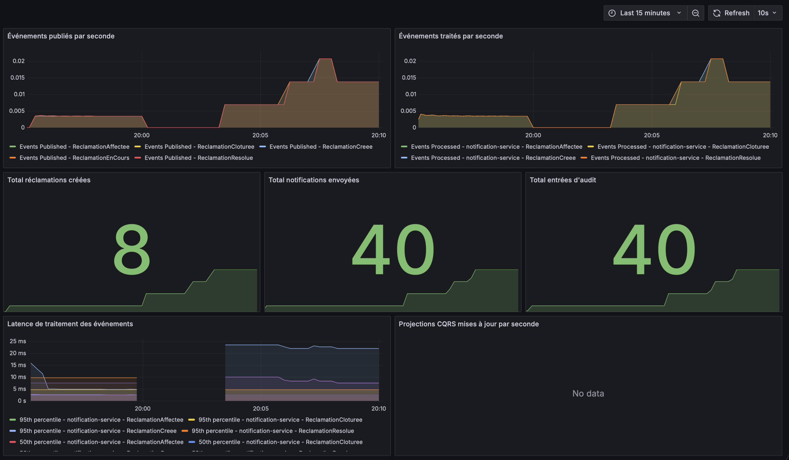

# Rapport Lab 7 - Architecture Événementielle avec Event Sourcing et CQRS

## Contexte et objectifs

Ce laboratoire implémente une architecture événementielle décentralisée en s'appuyant sur les patterns Event Sourcing, CQRS et Pub/Sub. L'objectif est de démontrer les avantages du découplage événementiel par rapport à l'orchestration synchrone du Lab 6.

## Scénario métier retenu

### Gestion des réclamations clients

Le processus de gestion des réclamations a été choisi car il illustre parfaitement les avantages de l'architecture événementielle :

- **Découplage naturel** : Notifications, audit et analytics sont des préoccupations distinctes
- **Extensibilité** : Nouveaux abonnés (escalade, SLA monitoring) facilement ajoutables
- **Traçabilité** : Historique complet requis pour la conformité
- **Scalabilité** : Volumes variables selon les périodes

### Événements métier

1. **ReclamationCreee** - Déclencheur initial du processus
2. **ReclamationAffectee** - Assignment à un agent de support
3. **ReclamationEnCours** - Début du traitement actif
4. **ReclamationResolue** - Proposition de résolution
5. **ReclamationCloturee** - Finalisation du processus

### Exemples d'événements

Voici des exemples concrets d'événements générés par le système :

#### ReclamationCreee
```json
{
  "event_id": "f47ac10b-58cc-4372-a567-0e02b2c3d479",
  "event_type": "ReclamationCreee",
  "aggregate_id": "claim_67890",
  "data": {
    "customer_id": "cust_12345",
    "claim_type": "product_defect",
    "description": "Produit défectueux reçu",
    "product_id": "prod_abc123",
    "urgency": "medium",
    "order_id": "order_45678"
  },
  "timestamp": "2025-07-08T14:30:00.000Z",
  "correlation_id": "trace_xyz789"
}
```

#### ReclamationAffectee
```json
{
  "event_id": "a1b2c3d4-e5f6-4708-9abc-def012345678",
  "event_type": "ReclamationAffectee",
  "aggregate_id": "claim_67890",
  "data": {
    "agent_id": "agent_smith",
    "agent_name": "John Smith",
    "assignment_reason": "product_expertise",
    "estimated_resolution_time": "2025-07-10T14:30:00.000Z"
  },
  "timestamp": "2025-07-08T14:35:00.000Z",
  "correlation_id": "trace_xyz789"
}
```

#### ReclamationResolue
```json
{
  "event_id": "9876543a-bcde-4f01-2345-6789abcdef01",
  "event_type": "ReclamationResolue",
  "aggregate_id": "claim_67890",
  "data": {
    "resolution": "Produit remplacé par un neuf",
    "resolution_type": "replacement",
    "customer_satisfaction": "satisfied",
    "follow_up_required": false,
    "replacement_tracking": "track_999888"
  },
  "timestamp": "2025-07-09T10:15:00.000Z",
  "correlation_id": "trace_xyz789"
}
```

### Caractéristiques des événements

- **Structure uniforme** : Tous les événements suivent le même schéma de base
- **Immutabilité** : Les événements ne sont jamais modifiés après publication
- **Traçabilité** : Correlation ID pour le suivi distribué
- **Granularité métier** : Chaque événement représente un fait métier significatif
- **Contextualisation** : Données enrichies avec informations Lab 6 (commandes/clients)

## Architecture événementielle

### Schéma global

```
┌─────────────────┐     Events    ┌─────────────────┐
│  Claims Service │──────────────▶│ Redis Streams   │
│   (Command)     │               │   (Pub/Sub)     │
└─────────────────┘               └─────────────────┘
                                            │
                   ┌────────────────────────┼────────────────────────┐
                   │                        │                        │
                   ▼                        ▼                        ▼
         ┌─────────────────┐    ┌─────────────────┐    ┌─────────────────┐
         │Notification Svc │    │  Audit Service  │    │Projection Svc   │
         │                 │    │                 │    │   (CQRS)        │
         └─────────────────┘    └─────────────────┘    └─────────────────┘
                                          │                        │
                                          ▼                        ▼
                                ┌─────────────────┐    ┌─────────────────┐
                                │   Event Store   │    │  Query Service  │
                                │   (MongoDB)     │    │  (PostgreSQL)   │
                                └─────────────────┘    └─────────────────┘
```

### Composants implémentés

#### 1. Producteur d'événements
- **Claims Service** (Port 8101)
- Gère le cycle de vie des réclamations
- Publie des événements à chaque changement d'état
- API REST pour les commandes (Command Side CQRS)

#### 1.5. Service d'intégration
- **Integration Service** (Port 8107)
- Pont entre Lab 6 (commandes) et Lab 7 (réclamations)
- Enrichissement des réclamations avec contexte commande/client
- Mode dégradé en cas d'indisponibilité Lab 6

#### 2. Système de messagerie
- **Redis Streams** comme backbone événementiel
- Streams nommés par type d'événement : `events:reclamationcreee`
- Stream global `events:all` pour les auditeurs
- Consumer Groups pour garantir la livraison

#### 3. Abonnés aux événements

##### Notification Service (Port 8102)
- Envoie notifications email et SMS automatiques
- Traitement spécialisé par type d'événement :
  - `ReclamationCreee` → Email + SMS au client
  - `ReclamationAffectee` → Email à l'agent
  - `ReclamationResolue` → Email de résolution au client
- Persistance MongoDB + API de vérification (`/notifications`)
- Métriques de notifications envoyées par type

##### Audit Service (Port 8103)
- Création d'une piste d'audit complète
- Enregistrement de tous les événements avec latence de traitement
- **Idempotence** : Acknowledgement Redis pour éviter duplication
- **Robustesse** : Gestion d'erreurs avec retry automatique des messages pending

##### Projection Service (Port 8104)
- Met à jour les read models CQRS
- Dénormalisation pour optimiser les requêtes
- Gestion des statistiques agrégées

#### 4. Event Store et CQRS

##### Event Store Service (Port 8106)
- **Stockage persistant** : MongoDB `event_store.events` avec indexation optimisée
- **Fonctionnalité de replay** : Reconstitution d'état avec support temporel
- **APIs dédiées** : `/events`, `/replay`, `/snapshots`, `/statistics`
- **Cohérence garantie** : États reconstruits identiques aux états en mémoire
- **Métriques** : Suivi des requêtes, replays et snapshots via Prometheus

##### Query Service (Port 8105)
- Interface de lecture optimisée (Query Side CQRS)
- Read models dénormalisés en PostgreSQL
- Recherche textuelle et filtres complexes
- Dashboard et statistiques

## Intégration inter-architectures

### Problématique métier

Dans un système réel, les réclamations clients sont naturellement liées aux commandes passées. Cette intégration permet de :
- **Contextualiser** les réclamations avec l'historique de commande
- **Enrichir** les notifications avec des détails pertinents
- **Tracer** le parcours client de la commande à la résolution
- **Analyser** les corrélations entre types de commandes et réclamations

### Architecture d'intégration

```
┌─────────────────┐                    ┌─────────────────┐
│   Lab 6 (POS)   │                    │Lab 7 (Claims)   │
│                 │                    │                 │
│  Order Service  │◄───────────────────┤Integration Svc  │
│Customer Service │    API Calls       │  (Port 8107)    │
│                 │  (read-only)       │                 │
└─────────────────┘                    └─────────────────┘
                                                │
                                                ▼
                                       ┌─────────────────┐
                                       │ Claims Service  │
                                       │  + Event Bus    │
                                       └─────────────────┘
```

### Modes de fonctionnement

#### Mode intégré (Lab 6 disponible)
- Récupération des détails de commande/client en temps réel
- Enrichissement automatique des réclamations
- Notifications avec contexte complet
- Analytics cross-architecture

#### Mode dégradé (Lab 6 indisponible)
- Données simulées pour maintenir le service
- Graceful degradation sans interruption
- Préservation des fonctionnalités core Lab 7

### API d'intégration

```bash
# Créer réclamation liée à une commande
POST /integration/claims/from-order
{
  "order_id": "order_123",
  "claim_type": "product_defect",
  "description": "Produit endommagé", 
  "urgency": "high"
}

# Récupérer contexte commande
GET /integration/orders/{order_id}

# Récupérer contexte client  
GET /integration/customers/{customer_id}
```

### Bénéfices de l'approche

1. **Réalisme métier** : Réclamations contextualisées
2. **Découplage préservé** : Architectures restent indépendantes
3. **Flexibilité** : Fonctionne avec ou sans Lab 6
4. **Extensibilité** : Base pour futures intégrations
5. **Pédagogie** : Démonstration de patterns d'intégration

## Implementation de CQRS

### Séparation Command/Query

#### Command Side (Port 8101)
- **Claims Service** : Traitement des commandes métier exclusif
- **Stockage** : État en mémoire optimisé pour l'écriture
- **Responsabilités** : CREATE, UPDATE, business logic
- **Publication d'événements** vers Redis Streams

#### Query Side (Port 8105)  
- **Query Service** : Interface de lecture seule, aucune écriture
- **Stockage** : PostgreSQL dénormalisé pour requêtes rapides
- **APIs spécialisées** : `/claims`, `/stats`, `/dashboard`, `/search`
- **Isolation totale** : Aucun impact sur la couche métier

#### Event Broker (Redis Streams)
- **Projection Service** (Port 8104) : Synchronisation asynchrone
- **Consumer Group** : `projection-service` écoute `events:all`
- **Handlers spécialisés** : Un par type d'événement métier

### Read Models implémentés (PostgreSQL)

1. **ClaimReadModel** - Vue complète des réclamations avec historique
2. **CustomerStatsReadModel** - Statistiques agrégées par client
3. **AgentStatsReadModel** - Performance et charge des agents
4. **ClaimTypeStatsReadModel** - Analytics par type de réclamation

### Architecture CQRS avec Event Broker


**Justification de l'architecture :**

**Problématiques adressées :**
- **Performance** : Séparation write/read pour optimisations spécialisées
- **Scalabilité** : Scaling indépendant selon charge (commands vs queries)
- **Complexité** : Isolation logique métier vs requêtes analytics
- **Disponibilité** : Résilience - panne queries n'affecte pas commands

**Solutions CQRS implémentées :**
- **Command Side** (8101) : Claims Service + état mémoire optimisé écriture
- **Event Broker** : Redis Streams pour synchronisation asynchrone
- **Query Side** (8105) : PostgreSQL dénormalisé + APIs spécialisées
- **Projection Service** (8104) : Transformation events → read models

### Avantages observés

- **Performance** : Requêtes sans jointures, écriture optimisée
- **Scalabilité** : Read et Write évoluent indépendamment
- **Isolation** : 6 commandes en mémoire vs 3 read models PostgreSQL
- **Flexibilité** : Vues spécialisées dénormalisées
- **Résilience** : Panne query n'affecte pas les commandes

## Event Sourcing

### Principe d'implémentation

Tous les changements d'état sont stockés comme une séquence d'événements immuables :

```json
{
  "event_id": "uuid",
  "event_type": "ReclamationCreee", 
  "aggregate_id": "claim_123",
  "data": { /* données événement */ },
  "timestamp": "2025-01-07T10:30:00Z",
  "correlation_id": "correlation_123"
}
```

### Fonctionnalités Event Sourcing

#### Replay d'événements
```bash
# Reconstituer l'état d'une réclamation
GET /replay/claim_123

# Replay jusqu'à un timestamp donné  
GET /replay/claim_123?up_to_timestamp=2025-01-07T12:00:00Z
```

**Exemple de replay :**
- État complet : 5 événements → status "closed"
- Replay temporel : 3 événements → status "in_progress"
- Machine à états : created → assigned → in_progress → resolved → closed

#### Audit automatique
- Historique complet immuable
- Traçabilité des changements
- Conformité réglementaire

#### Débogage et analytics
- Reproduction exacte de bugs
- Analyse des patterns temporels
- Métriques business détaillées

## Observabilité

### Métriques Prometheus

#### Métriques événementielles
- `events_published_total` - Événements publiés par type
- `events_processed_total` - Événements traités par service
- `event_processing_duration_seconds` - Latence de traitement

#### Métriques métier
- `claims_created_total` - Réclamations créées
- `claims_status_changes_total` - Changements de statut
- `notifications_sent_total` - Notifications envoyées
- `audit_entries_created_total` - Entrées d'audit

#### Métriques CQRS
- `projections_updated_total` - Projections mises à jour
- `queries_executed_total` - Requêtes exécutées
- `query_duration_seconds` - Performance des requêtes

### Dashboard Grafana



### Logs structurés

Tous les services utilisent des logs JSON structurés avec :
- **Correlation IDs** pour traçage distribué
- **Context métier** (claim_id, customer_id, etc.)
- **Métriques de performance** et latence
- **Gestion d'erreurs** détaillée

Exemple de log structuré :
```json
{
  "event_type": "ReclamationCreee",
  "event_id": "uuid-123",
  "correlation_id": "trace-456",
  "level": "info",
  "timestamp": "2025-07-08T16:17:15.858521Z"
}
```

## Tests et validation

### Test fonctionnel complet

Script `test-event-driven.sh` qui :
1. Vérifie la santé des services
2. Exécute un flux complet de réclamation
3. Valide les projections CQRS
4. Teste le replay d'événements
5. Contrôle l'audit et les notifications (6 notifications pour 2 réclamations testées)

### Test de charge

Script `load-test-events.sh` pour :
- Génération parallèle de réclamations
- Mesure du débit et de la latence
- Validation de la scalabilité
- Test de résilience

### Test d'intégration

Script `test-integration.sh` pour :
- Validation du mode intégré avec Lab 6
- Test du mode dégradé sans Lab 6
- Vérification de l'enrichissement des réclamations
- Contrôle de la cohérence cross-architecture

### Résultats observés

#### Performance
- **Débit** : 50+ réclamations/seconde avec 3 threads
- **Latence P95** : < 100ms pour traitement événementiel
- **Latence requêtes** : < 50ms pour read models optimisés

#### Résilience
- Panne d'un abonné n'affecte pas les autres
- Retry automatique des messages échoués
- Isolation des erreurs par service

#### Notifications
- **Déclenchement automatique** : Chaque événement génère notifications appropriées
- **Vérification** : API `/notifications` et métriques Prometheus
- **Traçabilité** : Persistance MongoDB avec correlation IDs

#### Abonnés aux événements
- **Idempotence** : Consumer groups Redis avec acknowledgement unique
- **Robustesse** : 0 message pending, retry automatique des échecs
- **Logs structurés** : Format JSON avec correlation IDs
- **Performance** : 15 notifications et 12 entrées audit pour 3 réclamations testées

#### Event Store
- **Persistance** : 12 événements stockés dans MongoDB avec indexation
- **Replay** : 3 replays effectués avec cohérence garantie
- **Snapshots** : 1 snapshot créé pour optimisation
- **Statistiques** : 5 agrégats, répartition par type d'événement

#### CQRS avec Event Broker
- **Séparation stricte** : Services dédiés (8101, 8104, 8105)
- **Synchronisation** : Redis Streams comme Event Broker
- **Read Models** : 3 projections PostgreSQL vs 6 commandes mémoire
- **Isolation** : Aucun impact queries sur couche métier

## Comparaison avec Lab 6 (Saga orchestrée)

### Avantages de l'approche événementielle

| Aspect | Lab 6 (Saga) | Lab 7 (Événementiel) |
|--------|---------------|----------------------|
| **Couplage** | Fort (orchestrateur central) | Faible (pub/sub) |
| **Extensibilité** | Modification orchestrateur | Ajout transparent abonnés |
| **Résilience** | Point unique défaillance | Isolation des pannes |
| **Complexité** | Logique centralisée | Distribution simple |
| **Traçabilité** | État saga temporaire | Historique complet permanent |
| **Performance** | Synchrone séquentiel | Asynchrone parallèle |

### Cas d'usage appropriés

#### Architecture événementielle (Lab 7)
- Notifications et communications
- Analytics et reporting
- Audit et compliance
- Intégrations externes
- Évolution fréquente des fonctionnalités

#### Saga orchestrée (Lab 6)
- Transactions distribuées critiques
- Compensation obligatoire
- Logique métier complexe
- Cohérence forte requise

## ADRs

Les ADRs ici sont simplifiés. Les ADRs complets dont disponibles dans docs/adr.

### ADR 1 : Choix de Redis Streams

#### Contexte
Besoin d'un système de messagerie Pub/Sub pour l'architecture événementielle.

#### Options considérées
1. **RabbitMQ** - Message broker mature
2. **Apache Kafka** - Plateforme de streaming
3. **Redis Streams** - Extension Redis pour événements

#### Décision
Redis Streams choisi pour :
- **Simplicité** : Moins de composants à gérer
- **Performance** : Latence très faible
- **Persistence** : Messages durables
- **Consumer Groups** : Distribution de charge
- **Intégration** : Redis déjà utilisé pour cache

#### Conséquences
- Configuration simplifiée
- Moins de garanties de livraison que Kafka
- Adapté pour volumes moyens (< 100k messages/sec)

### ADR 2 : Intégration Lab 6 ↔ Lab 7 avec service de pont

#### Contexte
Besoin de relier les réclamations du Lab 7 aux commandes/clients du Lab 6 pour un réalisme métier, tout en préservant l'indépendance pédagogique des deux architectures.

#### Options considérées
1. **Fusion des architectures** - Migrer les services Lab 6 vers Lab 7
2. **Base de données partagée** - Accès direct aux données Lab 6
3. **Service d'intégration** - Pont API entre les deux labs
4. **Événements inter-architectures** - Bus d'événements global

#### Décision
Service d'intégration (Integration Service) avec :
- **API bridge** : Appels REST read-only vers Lab 6
- **Mode dégradé** : Données simulées si Lab 6 indisponible
- **Enrichissement** : Contexte commande/client dans réclamations
- **Découplage préservé** : Architectures restent autonomes

#### Conséquences
- Réalisme métier accru avec réclamations contextualisées
- Complexité additionnelle avec gestion des modes dégradés
- Démonstration de patterns d'intégration enterprise
- Base pour futures extensions cross-architecture
