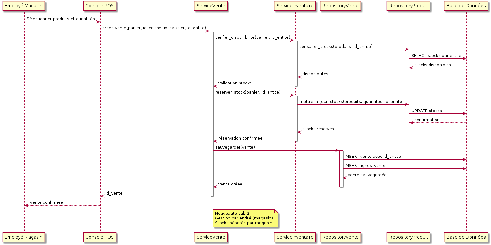
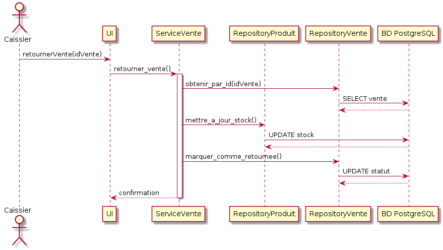
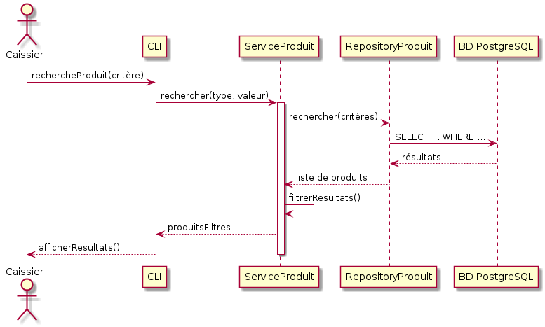
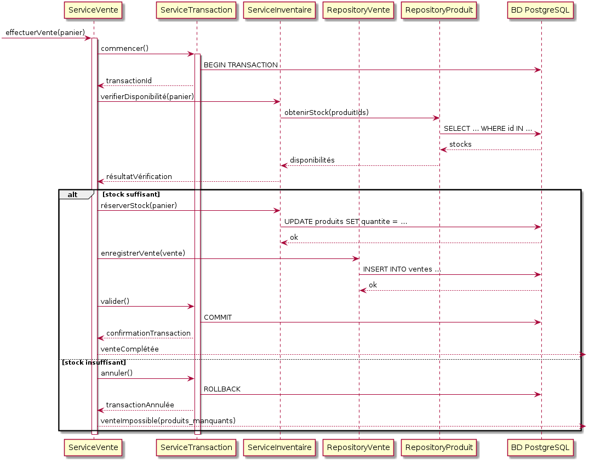
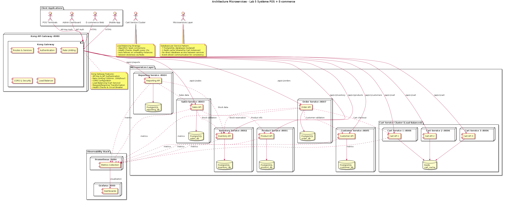
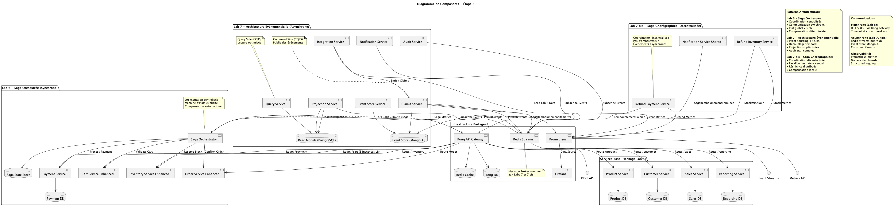
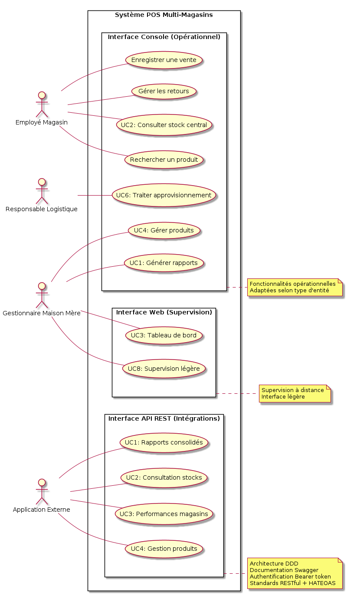

# Architecture du Système POS - Modèle 4+1

## Vue Logique

La vue logique représente les classes principales et leurs relations.

### Diagramme de classes

Classes principales:
- **Produit**: Représente un produit dans l'inventaire (avec prix, stock, catégorie)
- **Categorie**: Représente une catégorie de produits
- **Vente**: Représente une transaction de vente
- **LigneVente**: Un élément individuel dans une vente
- **Caissier**: Utilisateur du système
- **Caisse**: Représente une des 3 caisses physiques du système
- **ServiceProduit**: Gère la recherche de produits (par ID, nom, catégorie)
- **ServiceVente**: Orchestre une vente complète en utilisant les autres services
- **ServiceInventaire**: Gère les stocks et réservations (vérification/réservation/restitution)
- **ServicePaiement**: Gère les méthodes de paiement (simulation pour le lab)
- **ServiceTransaction**: Assure la cohérence des transactions avec la BD (BEGIN/COMMIT/ROLLBACK)

## Vue des processus

### Diagrammes de séquence

#### Processus de vente

#### Processus de retour

#### Processus de recherche de produit

#### Gestion des transactions et cohérence

Processus principaux:
1. Processus d'enregistrement d'une vente
2. Processus de gestion de l'inventaire
3. Processus de traitement des retours
4. Processus de recherche de produits
5. Processus de gestion des transactions (cohérence)

## Vue de déploiement

La vue de déploiement montre comment les composants sont déployés sur l'infrastructure selon une architecture client/serveur 2-tier.

### Architecture client/serveur 2-tier

**Serveur (Tier 1):**
- Base de données PostgreSQL dans un conteneur Docker dédié
- Gestion centralisée des données et transactions
- Assure la cohérence entre les 3 caisses simultanées

**Clients (Tier 2):**
- 3 applications console indépendantes (pos-client-1, pos-client-2, pos-client-3)
- Chaque client se connecte directement au serveur PostgreSQL
- Gestion des transactions ACID pour la cohérence du stock
- Interface utilisateur console pour les caissiers

### Avantages de cette architecture:
- **Vraie séparation client/serveur**: Base de données dans un conteneur séparé
- **Accès concurrent**: 3 caisses peuvent travailler simultanément
- **Cohérence des données**: PostgreSQL gère les transactions et verrous
- **Scalabilité**: Possibilité d'ajouter plus de clients facilement

## Vue d'implémentation

La vue d'implémentation montre comment le code est organisé.

Organisation des modules:
- **Client**: Point d'entrée et communication
- **Logique métier**: Classes et services métier
- **Persistance**: ORM et accès aux données (PostgreSQL via SQLAlchemy)
- **Utilitaires**: Fonctions auxiliaires (validation, formatage, etc.)

## Vue des cas d'utilisation

La vue des cas d'utilisation décrit les scénarios principaux du système.

### Cas d'utilisation principaux

Cas d'utilisation:
1. Rechercher un produit
2. Enregistrer une vente  
3. Gérer les retours
4. Consulter le stock