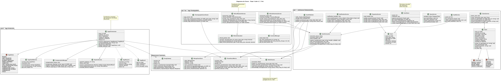

# Architecture du Système Microservices - Modèle 4+1

## Vue Logique

La vue logique représente l'architecture microservices avec 7 services indépendants et leurs interactions via Kong Gateway.

### Diagramme de classes microservices



### Architecture microservices (Evolution Lab 1 → Lab 5)

**Lab 1-3 : Architecture monolithique**
- Base de données centralisée unique
- Services métier partagés dans un seul processus
- Interface web MVC simple

**Lab 5 : Architecture microservices**
- **7 microservices autonomes** : Product, Customer, Cart, Order, Inventory, Sales, Reporting
- **Database per Service** : 7 PostgreSQL + 1 Redis (isolation des données)
- **Kong API Gateway** : Point d'entrée unique avec load balancing
- **Load balancing** : 3 instances de Cart Service avec failover automatique

### Services microservices détaillés

**Product Service (Port 8001)**
- **Responsabilité** : Catalogue produits et catégories
- **Base de données** : PostgreSQL (product_db)
- **APIs** : CRUD produits, recherche, gestion catégories
- **Bounded Context** : Product Catalog

**Customer Service (Port 8005)**
- **Responsabilité** : Gestion clients e-commerce
- **Base de données** : PostgreSQL (customer_db)
- **APIs** : Inscription, authentification JWT, profils, adresses
- **Bounded Context** : Customer Management

**Cart Service (Port 8006 - Load Balanced)**
- **Responsabilité** : Panier d'achat avec session persistence
- **Base de données** : Redis cache (cart_cache)
- **APIs** : Gestion panier, calcul taxes, session management
- **Load Balancing** : 3 instances avec Kong upstream

**Order Service (Port 8007)**
- **Responsabilité** : Commandes e-commerce et checkout
- **Base de données** : PostgreSQL (order_db)
- **APIs** : Processus checkout, gestion commandes, tracking
- **Bounded Context** : Order Management

**Inventory Service (Port 8002)**
- **Responsabilité** : Stocks multi-locations (magasins + e-commerce)
- **Base de données** : PostgreSQL (inventory_db)
- **APIs** : Gestion stocks, réservations, transferts, alertes
- **Bounded Context** : Inventory Management

**Sales Service (Port 8003)**
- **Responsabilité** : Ventes POS magasins physiques
- **Base de données** : PostgreSQL (sales_db)
- **APIs** : Transactions POS, encaissement, retours
- **Bounded Context** : POS Sales

**Reporting Service (Port 8004)**
- **Responsabilité** : Analytics et rapports multi-canaux
- **Base de données** : PostgreSQL (reporting_db)
- **APIs** : Rapports consolidés, dashboard, métriques performance
- **Bounded Context** : Business Intelligence

## Vue des processus

### Diagrammes de séquence microservices

#### Processus e-commerce complet (Customer → Product → Cart → Order)


#### Agrégation de données reporting multi-services


#### Load balancing avec failover automatique


### Processus clés microservices

1. **Processus d'authentification client** (Customer Service → Kong JWT)
2. **Processus de navigation produits** (Product Service via Kong)
3. **Processus de gestion panier** (Cart Service load-balanced avec Redis)
4. **Processus de checkout e-commerce** (Order Service + validation multi-services)
5. **Processus POS traditionnel** (Sales Service + Inventory validation)
6. **Processus de reporting multi-canaux** (Reporting Service + agrégation)

### Communication inter-services

- **Synchrone via Kong Gateway** : Toutes les API calls externes
- **Service-to-service** : HTTP REST via réseau microservices interne
- **Event-driven** : Events pour cohérence data cross-services
- **Shared cache** : Redis pour état partagé Cart Service instances

## Vue de déploiement

La vue de déploiement montre l'architecture microservices distribuée avec Kong Gateway.


### Architecture microservices distribuée

**Kong API Gateway Layer**
- **Kong Gateway** (Port 8080) : Point d'entrée unique
- **Features** : Authentication (API Key + JWT), Rate limiting, CORS, Load balancing
- **Upstream management** : Health checks, failover, circuit breaker
- **Monitoring** : Métriques Kong, admin API

**Microservices Layer**
- **7 services indépendants** avec isolation complète
- **Service discovery** : Kong routes configuration
- **Health monitoring** : Health checks automatiques
- **Load balancing** : Cart Service avec 3 instances actives

**Data Layer**
- **Database per Service** : 7 PostgreSQL databases isolées
- **Shared cache** : Redis pour Cart Service session state
- **Data consistency** : Event-driven synchronization
- **Backup strategy** : Individual service data protection

**Observability Stack**
- **Prometheus** (Port 9090) : Métriques collection
- **Grafana** (Port 3000) : Dashboards et visualisation
- **Kong Admin API** : Gateway monitoring et configuration

### Optimisations de performance microservices

**Kong Gateway optimizations**
- **Connection pooling** : Réutilisation connexions vers services
- **Response caching** : Cache responses fréquentes
- **Rate limiting** : 100 req/min, 1000 req/hour protection
- **Compression** : Gzip pour réduire bandwidth

**Service-level optimizations**
- **Database indexing** : Index optimisés per service
- **Redis caching** : Session state avec expiration
- **Connection pooling** : Pool connections entre services
- **Async processing** : Background jobs pour reports

**Load balancing strategies**
- **Least connections** : Distribution optimale Cart Service
- **Health checks** : Détection automatique pannes (15s)
- **Circuit breaker** : Protection cascade failures
- **Graceful degradation** : Fallback strategies

## Vue d'implémentation

La vue d'implémentation montre l'organisation microservices avec séparation bounded contexts.


### Organisation microservices

**Service Autonomy**
- **Separate codebases** : Un repository par service
- **Independent deployment** : Deploy cycles indépendants
- **Technology diversity** : Stack technique adaptée per service
- **Team ownership** : Équipes dédiées par bounded context

**Kong Gateway Components**
- **Route Management** : Configuration centralisée routing
- **Plugin Ecosystem** : Authentication, rate limiting, CORS, logging
- **Upstream Management** : Load balancing et health monitoring
- **Admin API** : Configuration et monitoring Kong

**Cross-cutting Concerns**
- **Event Bus** : Communication asynchrone inter-services
- **Metrics Collection** : Prometheus scraping tous services
- **Centralized Logging** : Aggregation logs avec correlation IDs
- **Configuration Management** : Environment variables per service

### Structure par service

**Standard microservice structure**
```
service/
├── app.py              # Flask application
├── models/             # Database models
├── services/           # Business logic
├── api/               # REST endpoints
├── database.py        # Database configuration
├── requirements.txt   # Dependencies
├── Dockerfile         # Container image
└── tests/             # Service tests
```

**Kong Gateway structure**
```
api-gateway/
├── kong.yml          # Kong configuration
├── openapi.yml       # API documentation
└── plugins/          # Custom plugins
```

### Qualité et observabilité microservices

**Testing strategies**
- **Unit tests** : Per service business logic
- **Integration tests** : Database et API endpoints
- **Contract tests** : API compatibility entre services
- **End-to-end tests** : Workflows complets via Kong
- **Load tests** : Performance testing avec k6

**Monitoring et métriques**
- **Service health** : Health checks Kong + Prometheus
- **Performance metrics** : Response times, throughput, errors
- **Business metrics** : Order conversion, cart abandonment
- **Infrastructure metrics** : CPU, memory, database performance

**Logging stratégique**
- **Structured logging** : JSON format avec correlation IDs
- **Centralized aggregation** : ELK stack ou équivalent
- **Request tracing** : Suivi requests cross-services
- **Error tracking** : Alerts automatiques sur erreurs critiques

## Vue des cas d'utilisation

La vue des cas d'utilisation décrit les scénarios e-commerce et POS via microservices.


### Acteurs et microservices

**Client E-commerce**
- Navigation catalogue (Product Service)
- Gestion compte (Customer Service)
- Panier shopping (Cart Service load-balanced)
- Commandes et checkout (Order Service)
- Suivi commandes (Order Service)

**Employé Magasin**
- Ventes POS (Sales Service)
- Consultation stocks (Inventory Service)
- Gestion retours (Sales Service)
- Encaissement (Sales Service)

**Gestionnaire/Admin**
- Gestion produits (Product Service)
- Analytics et rapports (Reporting Service)
- Gestion commandes (Order Service)
- Supervision stocks (Inventory Service)

**Applications Mobiles/Externes**
- APIs complètes via Kong Gateway
- Authentification API Key
- Rate limiting et sécurité
- Documentation OpenAPI

### Workflows microservices clés

**E-commerce Checkout Flow**
1. **Authentication** : Customer Service (JWT)
2. **Product Browse** : Product Service (catalog)
3. **Cart Management** : Cart Service (load-balanced Redis)
4. **Stock Validation** : Inventory Service (reservation)
5. **Order Creation** : Order Service (checkout processing)
6. **Payment Processing** : Order Service (gateway integration)

**POS Sales Flow**
1. **Product Lookup** : Product Service (catalog search)
2. **Stock Validation** : Inventory Service (availability)
3. **Sale Processing** : Sales Service (transaction)
4. **Payment** : Sales Service (cash/card)
5. **Receipt** : Sales Service (printing)

**Reporting Analytics Flow**
1. **Data Aggregation** : Reporting Service calls multiple services
2. **POS Data** : Sales Service (transactions)
3. **E-commerce Data** : Order Service (orders)
4. **Inventory Data** : Inventory Service (stock levels)
5. **Dashboard Generation** : Reporting Service (metrics)

## Aspects non-fonctionnels microservices

### Performance et scalabilité

**Horizontal scaling**
- **Service scaling** : Scale individual services based on load
- **Database scaling** : Read replicas per service
- **Cache scaling** : Redis cluster pour Cart Service
- **Load balancer scaling** : Kong Gateway clustering

**Performance targets**
- **API Response** : < 200ms p95 pour calls simples
- **E-commerce Checkout** : < 2s end-to-end
- **Dashboard Load** : < 1s aggregation multi-services
- **Throughput** : 1000+ concurrent users supported

### Résilience et disponibilité

**Fault tolerance**
- **Circuit breaker** : Protection cascade failures
- **Retry logic** : Automatic retry avec backoff
- **Timeouts** : Configured per service interaction
- **Graceful degradation** : Fallback strategies

**High availability**
- **Service redundancy** : Multiple instances per service
- **Database failover** : PostgreSQL replication
- **Load balancer HA** : Kong Gateway clustering
- **Geographic distribution** : Multi-region deployment ready

### Sécurité microservices

**Authentication et authorization**
- **API Gateway security** : Kong centralized auth
- **JWT tokens** : Customer authentication
- **API Keys** : External application access
- **mTLS** : Service-to-service communication
- **RBAC** : Role-based access per service

**Data protection**
- **Database encryption** : At-rest et in-transit
- **PCI compliance** : Payment data protection
- **GDPR compliance** : Customer data privacy
- **Audit logging** : Security events tracking

### Monitoring et observabilité

**Three pillars of observability**
- **Metrics** : Prometheus + Grafana (business + technical)
- **Logging** : Structured logging avec correlation IDs
- **Tracing** : Distributed tracing cross-services

**Alerting strategy**
- **Service health** : Immediate alerts on service down
- **Performance degradation** : Response time thresholds
- **Business metrics** : Order conversion rate drops
- **Infrastructure** : Resource utilization limits

### DevOps et déploiement

**CI/CD pipeline**
- **Independent deployment** : Per service deployment
- **Blue-green deployment** : Zero-downtime updates
- **Canary releases** : Gradual rollout nouvelles versions
- **Rollback strategy** : Quick rollback per service

**Infrastructure as Code**
- **Docker containers** : Consistent environments
- **Docker Compose** : Local development et testing
- **Kubernetes ready** : Production orchestration
- **Infrastructure automation** : Terraform pour cloud deployment

## Conclusion

L'architecture microservices Lab 5 représente une évolution majeure vers un système distribué, scalable et résilient, optimisé pour un contexte e-commerce moderne avec support POS legacy. Kong Gateway assure une gouvernance API centralisée tout en permettant l'autonomie des services.