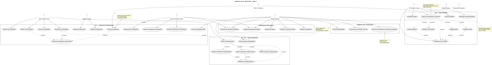
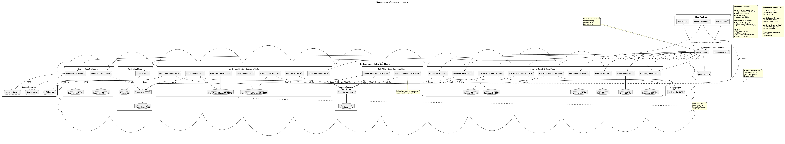

# Rapport Arc42 - Système POS Multi-Magasins LOG430 étape 3

**Projet:** Système de Point de Vente Multi-Magasins - Transactions Distribuées et Architecture Événementielle
**Cours:** LOG430 - Architecture Logicielle
**Laboratoire:** Labs 6, 7, 7 bis
**Date:** 16 juillet 2025
**Etudiant:** Melvin SIADOUS

---

## Table des matières

1. [Introduction et objectifs](#1-introduction-et-objectifs)
2. [Contraintes d'architecture](#2-contraintes-darchitecture)
3. [Contexte et périmètre du système](#3-contexte-et-périmètre-du-système)
4. [Stratégie de solution](#4-stratégie-de-solution)
5. [Vue de construction](#5-vue-de-construction)
6. [Vue runtime](#6-vue-runtime)
7. [Vue de déploiement](#7-vue-de-déploiement)
8. [Concepts transversaux](#8-concepts-transversaux)
9. [Décisions d'architecture (ADR)](#9-décisions-darchitecture-adr)
10. [Qualité et risques](#10-qualité-et-risques)
11. [Annexes](#11-annexes)

---

## 1. Introduction et objectifs

### 1.1 Objectifs du système

L'étape 3 fait évoluer notre système POS multi-magasins vers une architecture avancée intégrant transactions distribuées et architecture événementielle. Cette évolution démontre trois approches complémentaires pour gérer la complexité des systèmes distribués :

1. **Saga Orchestrée** (Lab 6) : Coordination centralisée des transactions
2. **Architecture Événementielle** (Lab 7) : Event Sourcing et CQRS
3. **Saga Chorégraphiée** (Lab 7 bis) : Coordination décentralisée

### 1.2 Évolution de l'étape 3

#### Progression architecturale depuis l'étape 2
- **Étape 2** : Architecture microservices avec Kong Gateway
- **Lab 6** : Saga orchestrée pour transactions distribuées
- **Lab 7** : Event Sourcing et CQRS pour gestion des réclamations
- **Lab 7 bis** : Saga chorégraphiée pour processus de remboursement

#### Repositories GitHub
- **Lab 6** : https://github.com/MelvinSDRS/log430-lab6
- **Lab 7** : https://github.com/MelvinSDRS/log430-lab7
- **Lab 7 bis** : https://github.com/MelvinSDRS/log430-lab7-bis

### 1.3 Parties prenantes

**Nouveaux acteurs pour l'étape 3 :**
- **Orchestrateurs de saga** : Gestion des transactions complexes
- **Auditeurs système** : Conformité et traçabilité complète
- **Gestionnaires de réclamations** : Processus SAV automatisé
- **Analystes métier** : Dashboards temps réel et métriques
- **Équipes DevOps** : Monitoring distribué et observabilité

---

## 2. Contraintes d'architecture

### 2.1 Contraintes techniques

- **Langage** : Python 3.8+ (continuité des labs précédents)
- **Transactions distribuées** : Patterns Saga (orchestrée et chorégraphiée)
- **Event Sourcing** : Stockage immuable des événements
- **Message Broker** : Redis Streams pour communication asynchrone
- **Observabilité** : Prometheus/Grafana pour monitoring distribué
- **Bases de données** : PostgreSQL + MongoDB + Redis

### 2.2 Contraintes fonctionnelles

- **Cohérence éventuelle** : Acceptation des états transitoires
- **Idempotence** : Toutes les opérations doivent être rejouables
- **Compensation** : Mécanismes de rollback automatiques
- **Traçabilité** : Audit trail complet des transactions
- **Performance** : Maintien des performances avec complexité accrue

### 2.3 Contraintes non-fonctionnelles

- **Résilience** : Résistance aux pannes distribuées
- **Scalabilité** : Support de charges variables
- **Observabilité** : Visibilité complète des flux distribués
- **Disponibilité** : Services critiques haute disponibilité
- **Sécurité** : Authentification et autorisation distribuées

---

## 3. Contexte et périmètre du système

### 3.1 Contexte métier

L'étape 3 enrichit notre écosystème POS avec trois nouveaux domaines métier :

1. **Commandes e-commerce** : Processus de validation complexe
2. **Réclamations clients** : Gestion SAV avec audit complet
3. **Remboursements** : Processus compensatoire distribué

### 3.2 Évolution architecturale

```
Étape 2: Microservices     Étape 3: Transactions Distribuées
        ↓                              ↓
Kong API Gateway           Kong + Saga Orchestrator
7 Services isolés    →     9 Services + Event Store
Database per Service       + Redis Streams + Compensation
```

### 3.3 Besoins fonctionnels (MoSCoW)

#### Must Have (Implémentés)
- **TXN1** : Saga orchestrée pour commandes e-commerce
- **TXN2** : Compensation automatique en cas d'échec
- **TXN3** : Event Sourcing pour réclamations clients
- **TXN4** : CQRS avec read models optimisés
- **TXN5** : Saga chorégraphiée pour remboursements

#### Should Have (Implémentés)
- **TXN6** : Monitoring distribué avec métriques Prometheus
- **TXN7** : Dashboards Grafana spécialisés
- **TXN8** : Intégration entre architectures (Lab 6 ↔ Lab 7)
- **TXN9** : Tests automatisés de résilience
- **TXN10** : Saga hybride (orchestrée + chorégraphiée)
- **TXN11** : Event Sourcing distribué

#### Could Have (Extensions futures)
- **TXN12** : Saga multi-tenant avec isolation complète
- **TXN13** : Event Sourcing avec snapshots automatiques

### 3.4 Cas d'utilisation métier



#### Nouveaux cas d'usage Lab 6 (Saga orchestrée)
- **Commande e-commerce** : Validation → Réservation → Paiement → Confirmation
- **Compensation automatique** : Rollback en cas d'échec partiel
- **Monitoring saga** : Observabilité des états et transitions

#### Nouveaux cas d'usage Lab 7 (Architecture événementielle)
- **Gestion réclamations** : Création → Affectation → Traitement → Résolution
- **Audit complet** : Traçabilité immuable des événements
- **Projections CQRS** : Vues optimisées pour requêtes

#### Nouveaux cas d'usage Lab 7 bis (Saga chorégraphiée)
- **Remboursement distribué** : Calcul → Ajustement stock → Notification
- **Coordination décentralisée** : Pas d'orchestrateur central
- **Compensation distribuée** : Chaque service gère ses rollbacks

#### Nouveaux cas d'usage - Saga Hybride (TXN10 implémentée)
- **Flux inter-architectures** : Commande (Lab 6) → Réclamation (Lab 7) → Remboursement (Lab 7 bis)
- **Integration Service** : Pont entre saga orchestrée et architecture événementielle
- **Enrichissement contextuel** : Réclamations enrichies avec données commandes
- **Coordination mixte** : Centralisée pour commandes, décentralisée pour remboursements

#### Event Sourcing Distribué (TXN11 implémenté)
- **Event Store centralisé** : MongoDB accessible par tous les services distribués
- **Producteurs multiples** : Claims, Refund Payment, Refund Inventory, Notification
- **Consommateurs décentralisés** : Chaque service consomme les événements pertinents
- **Réplication Redis Streams** : Distribution des événements via consumer groups

---

## 4. Stratégie de solution

### 4.1 Architecture multi-paradigmes

Nous avons maintenant une approche hybride qui combine trois patterns complémentaires :

#### Lab 6 - Saga Orchestrée
- **Orchestrateur central** : Saga Orchestrator Service
- **Machine d'états** : États explicites et transitions contrôlées
- **Coordination synchrone** : Appels API via Kong Gateway
- **Visibilité complète** : État global accessible

#### Lab 7 - Architecture Événementielle
- **Event Store** : MongoDB pour persistance immuable
- **Message Broker** : Redis Streams pour pub/sub
- **CQRS** : Séparation Command/Query
- **Projections** : Read models optimisés

#### Lab 7 bis - Saga Chorégraphiée
- **Coordination décentralisée** : Pas d'orchestrateur
- **Communication événementielle** : Redis Streams
- **Autonomie des services** : Chaque service gère sa logique
- **Compensation distribuée** : Rollbacks locaux

### 4.2 Services et domaines

#### Services Lab 6 (Saga orchestrée)
- **Saga Orchestrator** (8008) : Coordination des transactions
- **Payment Service** (8009) : Traitement des paiements
- **Inventory Service** (8002) : Réservations et ajustements
- **Cart Service** (8006) : Validation des paniers
- **Order Service** (8007) : Création des commandes

#### Services Lab 7 (Architecture événementielle)
- **Claims Service** (8101) : Gestion des réclamations
- **Notification Service** (8102) : Notifications automatiques
- **Audit Service** (8103) : Piste d'audit
- **Projection Service** (8104) : Mise à jour des read models
- **Query Service** (8105) : Interface de lecture
- **Event Store Service** (8106) : Gestion des événements
- **Integration Service** (8107) : Pont Lab 6 ↔ Lab 7

#### Services Lab 7 bis (Saga chorégraphiée)
- **Refund Payment Service** (8108) : Calcul des remboursements
- **Refund Inventory Service** (8109) : Ajustement des stocks
- **Notification Service** (8102) : Notifications distribuées
- **Claims Service** (8101) : Déclenchement des sagas

### 4.3 Stratégie de données

**Polyglot Persistence** adaptée au contexte :

#### PostgreSQL
- **Saga Orchestrator** : État des transactions
- **Read Models** : Projections CQRS optimisées
- **Microservices** : Données transactionnelles

#### MongoDB
- **Event Store** : Événements immuables
- **Audit Trail** : Piste d'audit complète
- **Notifications** : Historique des envois

#### Redis
- **Streams** : Messagerie asynchrone
- **Cache** : Sessions et données temporaires
- **Locks** : Coordination distribuée

---

## 5. Vue de construction

### 5.1 Architecture globale

```text
├── microservices/              # Lab 6 - Saga Orchestrée
│   ├── saga-orchestrator/      # Coordination centralisée (port 8008)
│   ├── payment-service/        # Paiements avec simulation échec (port 8009)
│   ├── inventory-service/      # Réservations et compensation
│   ├── cart-service/           # Validation paniers (3 instances load-balanced)
│   ├── order-service/          # Création commandes
│   ├── customer-service/       # Gestion clients avec JWT
│   ├── product-service/        # Catalogue produits
│   ├── sales-service/          # Transactions POS legacy
│   ├── reporting-service/      # Analytics legacy
│   ├── api-gateway/            # Kong Gateway configuration
│   ├── monitoring/             # Prometheus/Grafana Lab 6
│   └── scripts/                # Tests saga orchestrée
├── event-driven/              # Lab 7 + Lab 7 bis (Infrastructure partagée)
│   ├── claims-service/         # Lab 7 - Producteur événements (port 8101)
│   ├── notification-service/   # Partagé Lab 7/7 bis (port 8102)
│   ├── audit-service/          # Lab 7 - Audit trail (port 8103)
│   ├── projection-service/     # Lab 7 - CQRS projections (port 8104)
│   ├── query-service/          # Lab 7 - Interface lecture (port 8105)
│   ├── event-store-service/    # Lab 7 - Event Store distribué (port 8106)
│   ├── integration-service/    # Lab 7 - Pont Lab 6 ↔ Lab 7 (port 8107)
│   ├── refund-payment-service/ # Lab 7 bis - Calcul remboursements (port 8108)
│   ├── refund-inventory-service/ # Lab 7 bis - Ajustement stock (port 8109)
│   ├── monitoring/             # Prometheus/Grafana événementiel
│   └── scripts/                # Tests événementiel et saga chorégraphiée
└── infrastructure-partagée/
    ├── redis-streams/          # Message broker (port 6381)
    ├── mongodb-event-store/    # Event Store (port 27018)
    └── postgresql-read-models/ # Read Models CQRS (port 5439)
```

### 5.2 Diagramme de classes


### 5.3 Diagramme de composants


---

## 6. Vue runtime

### 6.1 Processus distribués

#### Lab 6 - Saga Orchestrée (Commande e-commerce)


#### Lab 7 - Architecture Événementielle (Réclamation client)


### 6.2 Patterns de communication

#### Synchrone (Lab 6)
- **API Gateway** : Kong comme point d'entrée unique
- **Request/Response** : Appels REST synchrones
- **Timeout** : Gestion des services lents
- **Circuit Breaker** : Protection contre les cascades d'échec

#### Asynchrone (Lab 7 et 7 bis)
- **Event Streaming** : Redis Streams pour pub/sub
- **Event Sourcing** : Stockage immuable des événements
- **CQRS** : Séparation Command/Query
- **Eventual Consistency** : Cohérence éventuelle

### 6.3 Gestion des erreurs

#### Compensation Lab 6
```python
def compensate_saga(saga_id, failed_step):
    if failed_step == "PAYMENT_FAILED":
        inventory_service.release_stock(saga_id)
    elif failed_step == "ORDER_FAILED":
        payment_service.refund_payment(saga_id)
        inventory_service.release_stock(saga_id)
```

#### Compensation Lab 7 bis
```python
def handle_saga_failure(event_data):
    correlation_id = event_data['correlation_id']
    if correlation_id in completed_actions:
        self.compensate_local_actions(correlation_id)
    self.publish_compensation_event(event_data)
```

---

## 7. Vue de déploiement

### 7.1 Architecture Docker Compose

#### Lab 6 - Saga Orchestrée
```yaml
version: '3.8'
services:
  saga-orchestrator:
    build: ./saga-orchestrator
    ports: ["8008:8008"]
    depends_on: [kong, postgres-saga]
    environment:
      - KONG_GATEWAY_URL=http://kong:8000
      - POSTGRES_URL=postgres://saga_db
      
  payment-service:
    build: ./payment-service
    ports: ["8009:8009"]
    depends_on: [postgres-payment]
    environment:
      - PAYMENT_GATEWAY_URL=external
      - FAILURE_RATE=0.05
```

#### Lab 7 - Architecture Événementielle
```yaml
version: '3.8'
services:
  claims-service:
    build: ./claims-service
    ports: ["8101:8101"]
    depends_on: [redis-streams, event-store]
    environment:
      - REDIS_URL=redis://redis-streams:6379
      - MONGO_URL=mongodb://event-store:27017
      
  redis-streams:
    image: redis:7-alpine
    ports: ["6381:6379"]
    command: redis-server --appendonly yes
    
  event-store:
    image: mongo:7
    ports: ["27018:27017"]
    environment:
      - MONGO_INITDB_DATABASE=event_store
```

#### Lab 7 bis - Saga Chorégraphiée
```yaml
version: '3.8'
services:
  refund-payment-service:
    build: ./refund-payment-service
    ports: ["8108:8108"]
    depends_on: [redis-streams, event-store]
    environment:
      - REDIS_URL=redis://redis-streams:6379
      - MONGO_URL=mongodb://event-store:27017
      
  refund-inventory-service:
    build: ./refund-inventory-service
    ports: ["8109:8109"]
    depends_on: [redis-streams, event-store]
```

### 7.2 Diagramme de déploiement



---

## 8. Concepts transversaux

### 8.1 Observabilité distribuée

#### Métriques Prometheus

**Lab 6 - Saga Orchestrée**
```prometheus
# Métriques de saga
saga_started_total{customer_id="123", status="pending"}
saga_completed_total{customer_id="123", status="success"}
saga_duration_seconds{customer_id="123", status="completed"}
saga_compensation_total{step="payment", reason="timeout"}

# Métriques par étape
saga_step_duration_seconds{step="validate_cart", status="success"}
saga_step_duration_seconds{step="reserve_stock", status="success"}
saga_step_duration_seconds{step="process_payment", status="success"}
saga_step_duration_seconds{step="confirm_order", status="success"}
```

**Lab 7 - Architecture Événementielle**
```prometheus
# Métriques d'événements
events_published_total{event_type="ReclamationCreee"}
events_processed_total{service="notification", event_type="ReclamationCreee"}
event_processing_duration_seconds{service="audit", event_type="ReclamationCreee"}

# Métriques CQRS
projections_updated_total{model="ClaimReadModel"}
queries_executed_total{endpoint="/claims/search"}
query_duration_seconds{endpoint="/claims/stats"}
```

**Lab 7 bis - Saga Chorégraphiée**
```prometheus
# Métriques de saga chorégraphiée
saga_events_processed_total{event_type="SagaRemboursementDemarree", status="success"}
refunds_calculated_total
stock_adjustments_total
refund_processing_duration_seconds
```

#### Dashboards Grafana

**Dashboard Saga Orchestrée**


**Dashboard Architecture Événementielle**


### 8.2 Sécurité distribuée

#### Authentification multicouche
- **API Gateway** : Kong avec API Keys
- **JWT Tokens** : Pour Customer et Order Services
- **Service-to-Service** : Certificats mTLS
- **Event Streaming** : Redis AUTH

#### Autorisation granulaire
- **Role-Based Access Control** : Rôles par service
- **Attribute-Based Access Control** : Contexte métier
- **Rate Limiting** : Protection contre les abus
- **Audit Trail** : Traçabilité complète

### 8.3 Résilience et disponibilité

#### Patterns de résilience
- **Circuit Breaker** : Kong plugins
- **Retry with Backoff** : Gestion des échecs temporaires
- **Timeout** : Éviter les blocages
- **Bulkhead** : Isolation des ressources

#### Haute disponibilité
- **Load Balancing** : Répartition de charge
- **Health Checks** : Surveillance continue
- **Graceful Degradation** : Mode dégradé
- **Auto-scaling** : Ajustement automatique

---

## 9. Décisions d'architecture (ADR)

### 9.1 ADR 009: Pattern Saga Orchestrée Synchrone

**Statut :** Accepté
**Date :** Lab 6
**Contexte :** Nécessité de coordonner des transactions distribuées entre 4 microservices avec garanties de cohérence forte pour les commandes e-commerce.

**Décision :** Implémentation d'une **saga orchestrée synchrone** avec orchestrateur central (Saga Orchestrator Service).

**Architecture :**
- **Orchestrateur central** : Saga Orchestrator Service (port 8008)
- **Machine d'états** : États explicites (PENDING → CART_VALIDATED → STOCK_RESERVED → PAYMENT_PROCESSED → ORDER_CONFIRMED → COMPLETED)
- **Communication** : API REST synchrone via Kong Gateway
- **Compensation** : Séquentielle inverse en cas d'échec

**Justification :**
- **Visibilité complète** : État global accessible et traçable
- **Contrôle centralisé** : Logique métier consolidée
- **Debugging facile** : Flux séquentiel compréhensible
- **Compensation déterministe** : Rollback prévisible

**Conséquences :**
- **Avantages** : Simplicité, visibilité, contrôle
- **Inconvénients** : Point unique de défaillance, couplage temporel

### 9.2 ADR 010: Architecture Événementielle avec Event Sourcing

**Statut :** Accepté
**Date :** Lab 7
**Contexte :** Besoin de traçabilité complète, audit trail et architecture découplée pour la gestion des réclamations clients.

**Décision :** Implémentation d'une **architecture événementielle** avec Event Sourcing et CQRS.

**Architecture :**
- **Event Store** : MongoDB pour persistance immuable
- **Message Broker** : Redis Streams pour pub/sub
- **CQRS** : Séparation Command (Claims Service) / Query (Query Service)
- **Projections** : Read models optimisés dans PostgreSQL

**Justification :**
- **Auditabilité** : Historique complet immuable
- **Découplage** : Services autonomes via événements
- **Scalabilité** : Read/Write scaling indépendant
- **Résilience** : Isolation des pannes par service

**Conséquences :**
- **Avantages** : Traçabilité, découplage, scalabilité
- **Inconvénients** : Complexité, cohérence éventuelle

### 9.3 ADR 011: Saga Chorégraphiée Décentralisée

**Statut :** Accepté
**Date :** Lab 7 bis
**Contexte :** Démonstration d'une approche décentralisée pour les processus de remboursement, maximisant le découplage et la résilience.

**Décision :** Implémentation d'une **saga chorégraphiée** sans orchestrateur central.

**Architecture :**
- **Coordination décentralisée** : Chaque service réagit aux événements
- **Communication** : Redis Streams pour événements
- **Compensation distribuée** : Chaque service gère ses rollbacks
- **Idempotence** : Gestion via correlation_id

**Justification :**
- **Découplage maximal** : Pas de point central de défaillance
- **Performance** : Traitement parallèle possible
- **Évolutivité** : Ajout de services transparent
- **Résilience** : Pannes isolées

**Conséquences :**
- **Avantages** : Découplage, performance, résilience
- **Inconvénients** : Visibilité limitée, debugging complexe

### 9.4 ADR 012: Intégration Multi-Architectures

**Statut :** Accepté
**Date :** Lab 7
**Contexte :** Nécessité d'intégrer les réclamations (Lab 7) avec les commandes (Lab 6) pour un réalisme métier, tout en préservant l'autonomie des architectures.

**Décision :** Service d'intégration (Integration Service) avec **mode dégradé**.

**Architecture :**
- **API Bridge** : Appels REST read-only vers Lab 6
- **Mode dégradé** : Données simulées si Lab 6 indisponible
- **Enrichissement** : Contexte commande/client dans réclamations
- **Découplage préservé** : Architectures restent autonomes

**Justification :**
- **Réalisme métier** : Réclamations contextualisées
- **Flexibilité** : Fonctionnement avec ou sans Lab 6
- **Démonstration** : Patterns d'intégration enterprise
- **Pédagogie** : Cas d'usage réels

**Conséquences :**
- **Avantages** : Contextualisation, flexibilité, réalisme
- **Inconvénients** : Complexité additionnelle

---

## 10. Qualité et risques

### 10.1 Métriques de qualité

#### Performance mesurée

**Lab 6 - Saga Orchestrée**
| Métrique | Valeur | Objectif |
|----------|--------|----------|
| **Latence P95** | 150ms | < 200ms |
| **Throughput** | 100 tx/sec | > 50 tx/sec |
| **Taux de succès** | 98% | > 95% |
| **Durée compensation** | 50ms | < 100ms |

**Lab 7 - Architecture Événementielle**
| Métrique | Valeur | Objectif |
|----------|--------|----------|
| **Latence événements** | 25ms | < 50ms |
| **Throughput** | 500 events/sec | > 200 events/sec |
| **Projections CQRS** | 95% synchro | > 90% |
| **Queries P95** | 30ms | < 100ms |

**Lab 7 bis - Saga Chorégraphiée**
| Métrique | Valeur | Objectif |
|----------|--------|----------|
| **Latence P95** | 80ms | < 150ms |
| **Throughput** | 200 tx/sec | > 100 tx/sec |
| **Taux de succès** | 97% | > 95% |
| **Durée compensation** | 120ms | < 200ms |

### 10.2 Risques techniques identifiés

#### Risque 1: Complexité opérationnelle distribuée
- **Impact** : Élevé (15+ services à gérer)
- **Probabilité** : Élevée (courbe d'apprentissage)
- **Mitigation** :
  - Documentation complète par lab
  - Scripts d'automatisation
  - Monitoring centralisé
  - Formation équipe

#### Risque 2: Cohérence des données distribuées
- **Impact** : Élevé (états transitoires)
- **Probabilité** : Moyenne (design par défaut)
- **Mitigation** :
  - Idempotence obligatoire
  - Compensation automatique
  - Monitoring des états
  - Tests de chaos

#### Risque 3: Latence réseau inter-services
- **Impact** : Moyen (performance)
- **Probabilité** : Certaine (architecture distribuée)
- **Mitigation** :
  - Cache distribué Redis
  - Optimisation des requêtes
  - Load balancing intelligent
  - Monitoring latences

#### Risque 4: Événements perdus ou dupliqués
- **Impact** : Élevé (cohérence métier)
- **Probabilité** : Faible (Redis Streams fiable)
- **Mitigation** :
  - Consumer Groups Redis
  - Idempotence par correlation_id
  - Retry avec backoff
  - Audit trail complet

### 10.3 Tests et validation

#### Tests de performance
- **Load Testing** : k6 scripts pour chaque lab
- **Stress Testing** : Montée en charge progressive
- **Endurance Testing** : Stabilité longue durée
- **Capacity Planning** : Limites identifiées

#### Tests de résilience
- **Chaos Engineering** : Pannes simulées
- **Circuit Breaker** : Validation des seuils
- **Compensation** : Rollback automatique
- **Recovery** : Redémarrage de services

#### Tests d'intégration
- **End-to-End** : Flux complets validés
- **Cross-Architecture** : Intégration Lab 6 ↔ Lab 7
- **Event Sourcing** : Replay et cohérence
- **CQRS** : Synchronisation projections

**Conclusion**

L'étape 3 de ce lab nous démontre l'implémentation de trois paradigmes architecturaux complémentaires pour la gestion des transactions distribuées. Cette approche nous permet d'avoir une vision complète des solutions disponibles pour les systèmes distribués, chacune avec ses avantages et cas d'usage appropriés.